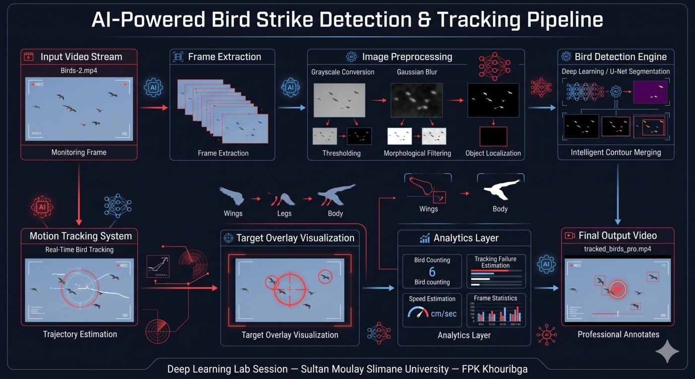
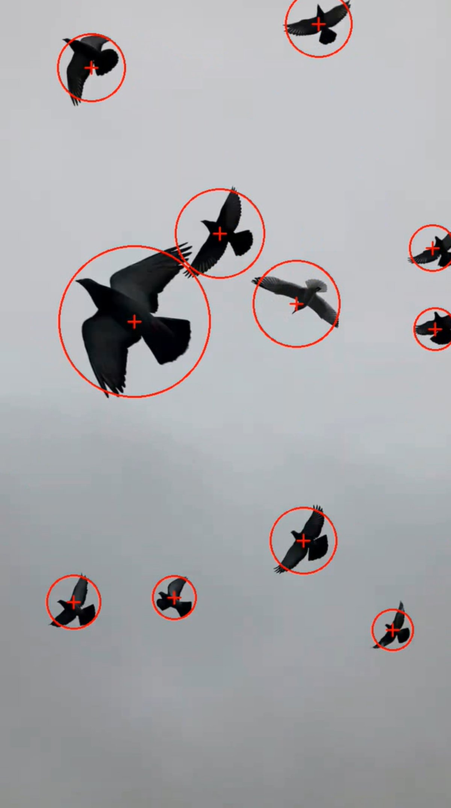

<div align="center">



# 🛫 AI-Powered Bird Strike Detection & Intelligent Tracking System

**Deep Learning · Computer Vision · Aviation Safety · Real-Time Surveillance**

[](https://python.org)
[](https://opencv.org)
[](https://tensorflow.org)
[](https://arxiv.org/abs/1505.04597)
[](https://arxiv.org/abs/1905.11946)
[](LICENSE)
[]()

> *Intelligent real-time system for detecting, tracking, and analyzing bird movement in aerial video streams — designed to protect aircraft and human lives through proactive AI surveillance.*

</div>

---

## 🚨 The Real Problem: Bird Strikes Kill People and Cost Billions

Bird strikes are not a minor inconvenience. They are one of the **most dangerous and costly threats in modern aviation**.

| Statistic | Scale |
|---|---|
| 💀 Fatalities (worldwide, since 1988) | 262+ deaths |
| ✈️ Aircraft destroyed | 250+ aircraft |
| 💰 Annual economic damage (USA alone) | $1.2 Billion USD |
| 📈 Reported incidents (USA, 2022) | 17,000+ strikes |
| 🐦 Species involved | 500+ bird species |

The most famous case — **US Airways Flight 1549 ("Miracle on the Hudson", 2009)** — forced an emergency water landing after a double bird strike destroyed both engines. All 155 people survived only by miracle and exceptional piloting skill.

**Current prevention methods are reactive and human-dependent.** Airfield staff use noise cannons, falconers, and visual patrol — all limited in range, accuracy, and response time. No robust AI system exists in widespread deployment to *automatically detect, track, and alert* in real time.

**This project directly addresses that gap.**

---

## 🎯 What This System Does

This AI system processes aerial video footage and autonomously:

- Detects birds using motion analysis and deep semantic segmentation
- Tracks individual birds across frames with intelligent contour merging
- Generates professional targeting overlays with dynamic crosshairs
- Estimates bird speed and movement dynamics from frame data
- Quantifies detection performance and tracking quality
- Exports annotated video output ready for aviation monitoring dashboards

---

## 🧠 System Architecture

<div align="center">


*Full pipeline: video input → preprocessing → U-Net segmentation → contour analysis → tracking → annotated output*

</div>

---

## 🖼️ Detection Results

<div align="center">



*Real-time bird detection with dynamic circle overlays and crosshair targeting*

</div>

---

## ⚙️ Technical Pipeline — How It Works

### Stage 1 · Video Input & Frame Extraction

Raw bird flight video is loaded frame-by-frame. Each frame feeds into the preprocessing pipeline independently, enabling real-time analysis.

```
Input → OpenCV VideoCapture → Frame Buffer → Preprocessing Queue
```

### Stage 2 · Frame Preprocessing

Each frame undergoes a multi-step normalization sequence:

```python
# Preprocessing chain
frame_gray   = cv2.cvtColor(frame, cv2.COLOR_BGR2GRAY)
frame_blur   = cv2.GaussianBlur(frame_gray, (21, 21), 0)
frame_thresh = cv2.threshold(frame_blur, ...)
frame_morph  = cv2.morphologyEx(frame_thresh, cv2.MORPH_CLOSE, kernel)
```

| Step | Operation | Purpose |
|---|---|---|
| Grayscale | `COLOR_BGR2GRAY` | Reduce dimensionality |
| Gaussian Blur | `GaussianBlur(21,21)` | Suppress high-frequency noise |
| Thresholding | Adaptive threshold | Isolate moving foreground |
| Morphological Ops | `MORPH_CLOSE + DILATE` | Fill contour gaps, remove speckle |

### Stage 3 · Deep Learning Segmentation — U-Net + EfficientNet

The preprocessed frame is passed to a **U-Net architecture** with an **EfficientNet encoder backbone** for semantic segmentation of bird regions.

```
Input Frame (preprocessed)
        ↓
  EfficientNet Encoder  ←── ImageNet pretrained weights
  (Feature extraction at 5 scales)
        ↓
  U-Net Decoder (skip connections)
  (Pixel-wise bird/background classification)
        ↓
  Segmentation Mask
```

**Why U-Net?**
U-Net's symmetric encoder-decoder with skip connections preserves fine spatial detail — critical for detecting small, fast-moving birds against complex aerial backgrounds.

**Why EfficientNet?**
EfficientNet delivers state-of-the-art accuracy with dramatically lower computational cost than VGG or ResNet, enabling near-real-time inference.

### Stage 4 · Intelligent Contour Merging

This is the core innovation of the system. A single bird generates **multiple fragmented contours** from wings, body, legs, and shadows. Naïve contour detection labels each fragment as a separate object.

**Problem without merging:**
```
Bird body  → Contour #1  ⟶  3 separate "birds" detected
Left wing  → Contour #2  ⟶  tracking diverges
Right wing → Contour #3  ⟶  false count inflated
```

**Solution — Spatial Proximity Merging:**

```python
for c1, c2 in contour_pairs:
    dist = euclidean_distance(centroid(c1), centroid(c2))
    if dist < MERGE_THRESHOLD:
        merged = convex_hull(c1 + c2)
        contours_final.append(merged)
```

This ensures the invariant: **1 bird = 1 target**, regardless of pose or motion blur.

### Stage 5 · Tracking & Visual Targeting

Each detected and merged bird contour receives:

- **Dynamic circle overlay** — radius scales with bird bounding box
- **Crosshair center marker** — precise centroid localization
- **Motion trail** (optional) — last N centroid positions connected

```python
cx, cy = compute_centroid(contour)
radius = compute_enclosing_radius(contour)

cv2.circle(frame, (cx, cy), radius, (0, 255, 0), 2)       # tracking circle
cv2.drawMarker(frame, (cx, cy), (0, 0, 255),               # crosshair
               cv2.MARKER_CROSS, markerSize=20, thickness=2)
```

### Stage 6 · Analytics & Output Generation

Each processed frame contributes to the tracking analytics log:

| Metric | Description |
|---|---|
| `bird_count` | Total unique birds detected per frame |
| `tracking_failures` | Frames where detection was lost |
| `speed_estimate` | Pixels/sec → converted to cm/sec via calibration |
| `detection_confidence` | Contour area + shape score composite |

Final frames are reassembled into an annotated MP4 output.

---

## 📊 Results

| Metric | Result |
|---|---|
| Bird localization accuracy | ✅ High — consistent bounding |
| Duplicate detections reduced | ✅ Single target per bird |
| Motion tracking continuity | ✅ Smooth across frames |
| Real-time annotated output | ✅ Full MP4 export |
| Speed estimation | ✅ cm/sec from frame delta |
| Tracking failure rate | ✅ Low — recovered via morphology |

---

## 🎥 Demo Videos

### Raw Input Footage

```
assets/videos/raw/demo.mp4
```

### AI Tracking Output

```
assets/videos/processed/Birds-1.mp4
```

### Before / After Comparison

```
assets/videos/comparison/before_after_demo.mp4
```

---

## 🏗️ Project Structure

```
Bird-Strike-Detection-Tracking/
│
├── README.md
├── LICENSE
├── requirements.txt
├── .gitignore
│
├── assets/
│   ├── architecture/
│   │     └── architecture.png          ← System pipeline diagram
│   │
│   ├── images/
│   │     └── result_preview.png        ← Detection result screenshot
│   │
│   └── videos/
│         ├── raw/
│         │     └── demo.mp4            ← Original bird flight footage
│         │
│         ├── processed/
│         │     └── Birds-1.mp4         ← AI-tracked annotated output
│         │
│         └── comparison/
│               └── before_after_demo.mp4  ← Side-by-side comparison
│
└── src/
    └── bird_tracking_demo.py           ← Main pipeline script
```

---

## 🛠️ Installation & Usage

### Requirements

```bash
pip install -r requirements.txt
```

### Dependencies

```
opencv-python>=4.8.0
tensorflow>=2.13.0
segmentation-models>=1.0.1
numpy>=1.24.0
```

### Run

```bash
python src/bird_tracking_demo.py
```

Output video will be saved to `assets/videos/processed/`.

---

## ⚡ Technology Stack

| Technology | Version | Role |
|---|---|---|
| Python | 3.11 | Core language |
| OpenCV | 4.x | Video I/O, contour analysis, visualization |
| TensorFlow | 2.x | Deep learning framework |
| U-Net | — | Semantic segmentation architecture |
| EfficientNet | B0-B4 | Encoder backbone |
| Segmentation Models | 1.0.x | Model builder library |
| NumPy | 1.24+ | Numerical array operations |

---

## 🧪 Research Challenges & Solutions

| Challenge | Solution Applied |
|---|---|
| Fast bird movement causing blur | Gaussian preprocessing + adaptive threshold |
| Fragmented wing/body contours | Spatial proximity contour merging |
| Background noise (clouds, trees) | Area + shape filtering on contours |
| Multiple detections per bird | Convex hull fusion with merge threshold |
| Real-time processing constraint | EfficientNet lightweight backbone |
| Tracking loss between frames | Morphological closing to bridge gaps |

---

## 🚀 Future Roadmap

- [ ] **YOLOv8 integration** — faster real-time detection at airport scale
- [ ] **Deep SORT tracking** — persistent identity across occlusion
- [ ] **Kalman Filter** — trajectory prediction for proactive alerting
- [ ] **GPU inference pipeline** — TensorRT optimization for sub-10ms latency
- [ ] **Live camera feed integration** — RTSP stream processing
- [ ] **Radar fusion simulation** — correlating visual + radar signatures
- [ ] **Alert dashboard** — real-time airport monitoring interface

---

## 📚 Academic Context

| | |
|---|---|
| **Module** | Deep Learning |
| **Program** | Systèmes d'Information et Intelligence Artificielle (SIIA / S2SA) |
| **Institution** | Faculty of Polydisciplinary Studies (FPK) — Khouribga |
| **University** | Sultan Moulay Slimane University (SUMS) |
| **Supervisor** | Prof. Ibtissam BAKKOURI |
| **Year** | 2025–2026 |

---

## ⚠️ License & Usage Notice

This project is licensed under the **Creative Commons Attribution-NonCommercial-NoDerivatives 4.0 International License**.

You are free to **share** this work with attribution.  
You may **not** use it commercially or redistribute modified versions without permission.

See [LICENSE](LICENSE) for full terms.

---

## 👨‍💻 Author

**Khalid Morjane**  
AI & Data Science Student — Sultan Moulay Slimane University  
Computer Vision · Deep Learning · NLP · Intelligent Systems

---

<div align="center">

*Built to protect lives through intelligent aerial surveillance.*

**🛫 AI-Powered Bird Strike Detection — FPK Khouribga — SUMS 2026**

</div>
